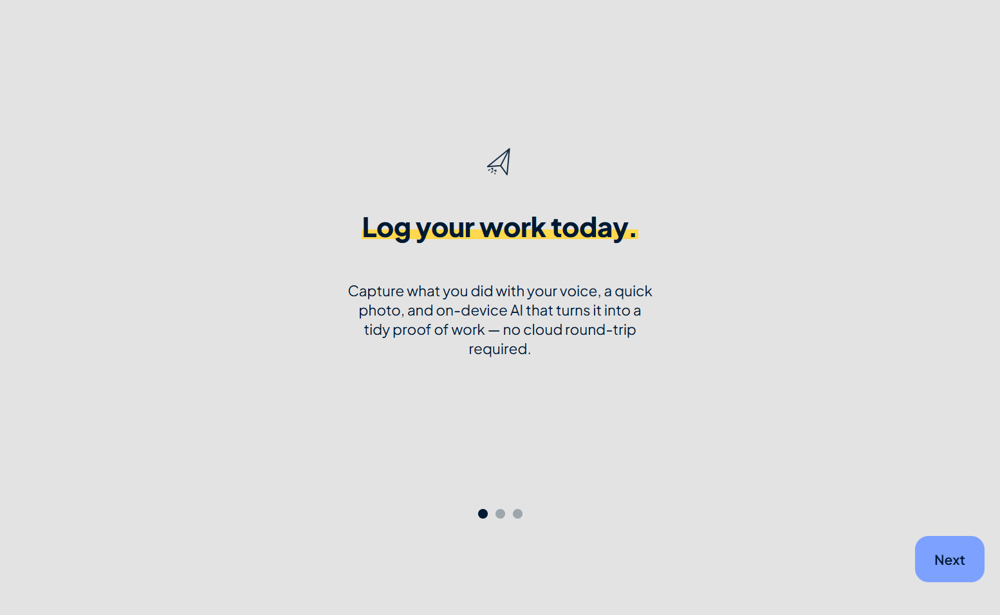
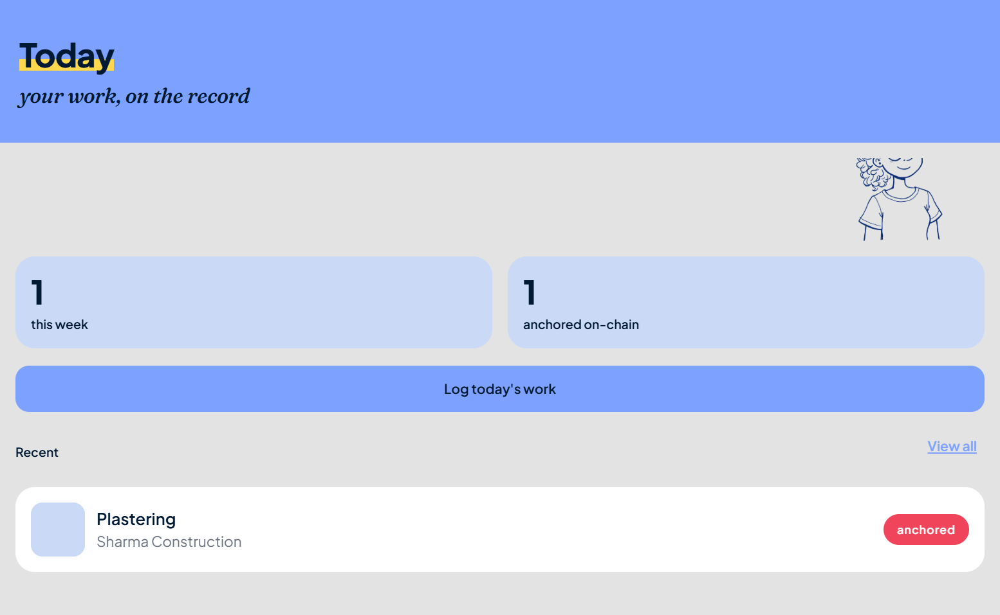
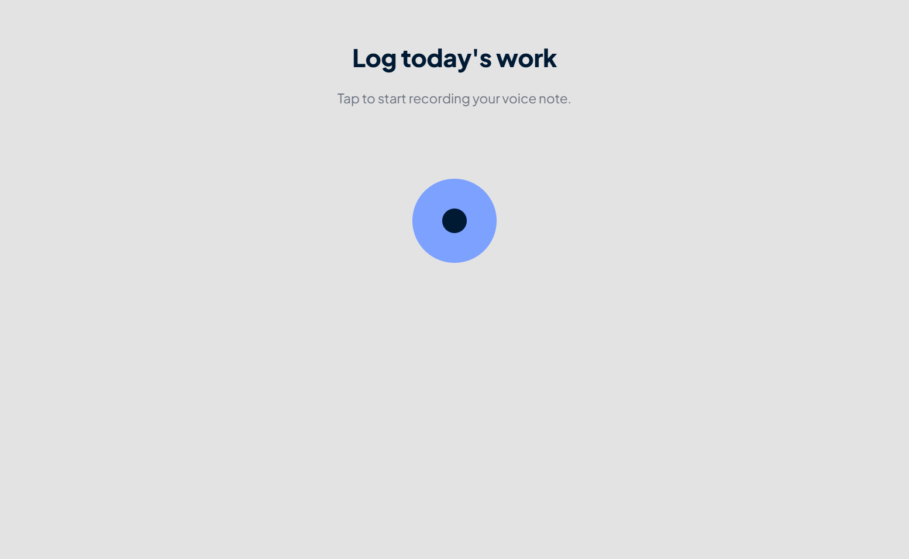
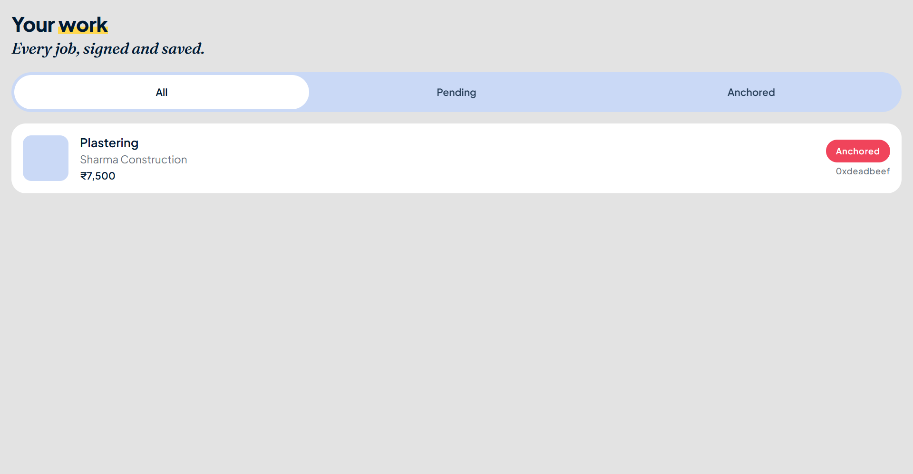

# WorkProof

Field-ready proof-of-work capture for crews and contractors. Snap a photo, record a voice note, and produce a signed, shareable PDF that a homeowner or PM can verify on the spot.

**Live demo (web):** <https://workproof-demo.vercel.app> — Peggy design system in the browser. Camera / mic / on-chain paths are no-ops on web; use Expo Go for the full flow.

## Screens

| Onboarding | Home | Log Work | History |
| --- | --- | --- | --- |
|  |  |  |  |

## What it does

WorkProof turns a 30-second site walkthrough into a tamper-evident record:

- **Photo + voice + location** captured in a single flow.
- **Audio + editable transcript** — the voice memo is the reference; the crew types the short report in an editable transcript field. Optional Gemini extraction pulls work type / client / amounts from the text.
- **Cryptographic signing** (ethers.js) binds the bundle to a job key so the artifact can be re-verified later.
- **PDF export + share sheet** so the proof leaves the device through whatever channel the crew already uses (WhatsApp, email, SMS).

## Repository layout

```
workproof/
  app/             Expo / React Native client (the thing the crew runs)
  contracts/       Smart-contract scaffolding for on-chain anchoring
  docs/            Design docs, demo scripts, decision records
  _styleguide/     Brand assets, typography, color tokens, doodles
```

- `app/` is the only package you need to run for the demo. See `app/README.md` for prereqs and the 90s demo path.
- `contracts/` is optional and not exercised by the mobile demo. `WorkProofAnchor.sol` compiles under solc 0.8.24; deployment via `PRIVATE_KEY=… npx ts-node contracts/deploy.ts` once ABI + bytecode are pasted.
- `docs/` holds the demo script, onepager, pitch deck.
- `_styleguide/peggy-export/` is where the Fraunces + Plus Jakarta Sans stack, marker doodles, and paper-and-ink palette are defined.

## Quickstart

```bash
git clone https://github.com/kaushiksaravanan/workproof.git
cd workproof/app
npm install
npx expo start
```

Then open Expo Go on an Android phone, scan the QR code, and you're in. Full prereqs, permissions, env vars, Vercel deploy path, and troubleshooting live in [`app/README.md`](app/README.md).

## Status

Demo-grade. The app boots, captures, signs, and exports end-to-end. 567 tests across 37 suites are green; TypeScript is clean under `strict`. Contracts compile but aren't deployed to Amoy. The Vercel web build ships without native modules (camera / mic) but with the full Peggy UI + a serverless `/api/vend` proxy that keeps the CipherStack service token off the client.
